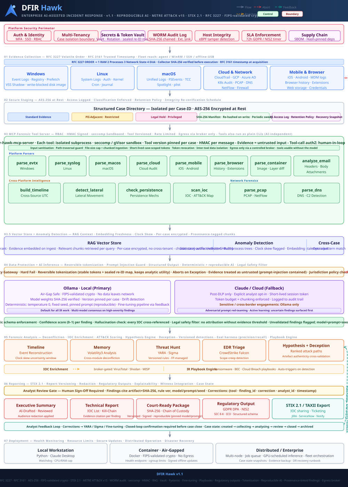

# DFIR Hawk

[](https://github.com/subashjaganathan/dfir-hawk/actions/workflows/ci.yml)
[](LICENSE)
[](#)

**DFIR Hawk** is an open-source, offline-first incident-response platform. **This
repository is where the platform is built** - layer by layer - against the
reference architecture in [`Docs/architecture.svg`](Docs/architecture.svg): an
AI-assisted, MCP-driven, cross-platform DFIR pipeline with explainable triage,
RAG, hard-fail DLP, local-first AI, and court-ready reporting.

### Available now - Windows collection & analysis engine (Component 1)

A dependency-free PowerShell **collector** that produces a sealed `.hawk`
evidence session, and a .NET 8 **analyzer** (`hawk.exe`) that imports it, scores
artifacts with a false-positive-resistant Malware Risk Index (MRI), parses raw
forensic artifacts (EVTX/prefetch/shimcache/amcache/`$MFT`/`$UsnJrnl`/SRUM), runs
an optional Volatility3 memory hand-off, matches IOCs, tags findings with MITRE
ATT&CK, and produces an interactive UI and a self-contained HTML report. Runs on
**Windows 7 SP1 -> Windows 11 / Server 2025** - an original, clean-room
implementation (known-good whitelist built from NIST NSRL).

Right now we are building the Windows engine. From there, we build out the rest
of the architecture one layer at a time.

## Download

Prebuilt binaries are attached to the latest release:
**[Releases](https://github.com/subashjaganathan/dfir-hawk/releases/latest)**

- `HawkCollector.exe` - self-extracting, self-elevating collector (run on the target host)
- `hawk.exe` - the analyzer (import a `.hawk`; no install)
- `SHA256SUMS.txt` - verify integrity before running

Binaries are currently unsigned (SmartScreen/EDR may warn); code-signing is on
the roadmap. Or build from source (see Quick start).

## Platform architecture

The diagram is the blueprint we build against - every part of this repo maps to
one of its layers. The table tracks what is implemented versus planned.



| Layer | In the architecture | Status here |
|-------|---------------------|-------------|
| 01 Collection | Win/Linux/macOS/Cloud/Mobile, RFC 3227 order | **Done** - Windows (53 modules, RFC 3227); other platforms planned |
| 02 Staging | Encrypted, classified case directory | Partial - sealed, hash-verified `.hawk` (encryption/classification planned) |
| 03 MCP tool server | Sandboxed forensic MCP tools for AI | Planned (parsers exist as analyzer libraries today) |
| 03.5 RAG / anomaly | Vector store, outlier detection | Planned |
| 04 DLP + AI | Local-first (Ollama) / cloud fallback, hard-fail DLP | Planned |
| 05 Analysis | Timeline, memory, threat-hunt, MRI, ATT&CK | **Done** - MRI + ATT&CK findings + Volatility3 memory; YARA/Sigma planned |
| 06 Reporting | STIX 2.1, court-ready, regulatory, exec summary | Partial - self-contained HTML report; STIX/regulatory planned |
| 07 Deployment | Local / air-gapped container / distributed | Partial - single-file + folder collector; container/distributed planned |
| Perimeter | Auth, Vault, WORM audit, RBAC, SBOM | Planned |

Status: **Done** = implemented - Partial = in progress - Planned = not started.

---

## The idea (why we're building this)

Most IR tooling forces a choice: powerful but heavy platforms that need servers,
agents, and cloud, or lightweight collectors that leave you to analyze the dump
yourself. DFIR Hawk is built on a different set of beliefs:

1. **Offline-first.** It must run on an isolated, quarantined, or air-gapped
   host with no internet and no install. Nothing phones home by default.
2. **Explainable, not a black box.** Every verdict is scored on a transparent
   trust ladder (known-good hash -> signer -> baseline -> rules) and tagged with
   MITRE ATT&CK, so an analyst sees *why*, not just *what*.
3. **AI is an assistant, never the oracle.** The model drafts and prioritizes;
   a human signs off. AI runs deterministically and every AI-derived finding is
   reproducible and cited back to raw evidence - so it holds up under scrutiny.
4. **Evidence integrity end to end.** Raw artifacts are hash-sealed at capture
   and every downstream finding traces back to `artifact + offset + SHA-256`.
5. **Privacy without blindness.** Sensitive fields are reversibly *tokenized*
   (not blindly scrubbed), so analysis stays useful while data stays protected.
6. **Build it in the open, one layer at a time.** Windows triage engine first,
   proven and tested, then each architecture layer added deliberately.

The goal: a free, auditable tool a junior analyst can run in the field and a
court will accept - collect in one command, get an explainable, ATT&CK-mapped,
reproducible result.

## How the design handles the hard problems

The reference architecture is deliberately engineered around the failure modes
that sink naive "AI + forensics" designs:

| Hard problem | Design decision |
|--------------|-----------------|
| AI output isn't reproducible (admissibility) | Deterministic inference (temperature 0, fixed seed, pinned prompt+model per case); every finding records model+prompt+seed |
| Scrubbing PII blinds the analysis | **Reversible tokenization** with a sealed re-identification map - keeps hostnames/IPs/accounts analytically useful without exposing them |
| "Zero-egress" vs. IOC enrichment (VirusTotal/Shodan/MISP) | A single **policy-gated egress broker**; no automatic sample submission (OPSEC) |
| Prompt injection *from the evidence itself* | Evidence is treated as untrusted input to the model; tool calls require authorization, with human-in-loop for state-changing tools |
| Losing chain of custody through RAG | Every embedded chunk carries `artifact + offset + SHA-256`; per-case encrypted collections, no cross-tenant embeddings |
| Reaching quarantined / remote hosts | Fleet reach via signed agent / WinRM / SSH / offline-USB (push or pull) |
| The platform depending on the AI to work | Forensic tools also run as plain, deterministic CLIs - fully usable without the model |
| Detection quality / drift | Versioned Sigma/YARA rules, false-positive management, and an evaluation harness (precision/recall vs. known cases) |
| Overstated crypto claims | FIPS-validated crypto module (not a checkbox); honest about what is validated |

See the full picture in [`Docs/architecture.svg`](Docs/architecture.svg).

---

## Why it exists

The predecessor (`windows-dfir-toolkit`) collected well but its analysis was
noisy: single-signal rules (any `certutil`, any HKCU CLSID, any unsigned binary)
produced wall-to-wall false positives, and its HTML output was inaccurate.

DFIR Hawk fixes that at the architecture level by separating **collection** from
**analysis**:

- **Collector** emits *raw observations only* - no verdicts, no severity.
- **Analyzer** applies a **trust ladder** (known-good hash -> org baseline ->
  trusted signer -> expected-process conformance) and only *scores what
  survives*. Findings require **converging signals**, not one rule.

On a clean reference workstation the analyzer reports mostly **trusted** with a
handful of low/medium items - not a screen of red.

---

## Windows engine - how it works (Component 1)

```
Target host  ->  sealed .hawk (ZIP + SHA256)  ->  Analyst workstation

Hawk Collector (PowerShell 5.1) on the target host:
  - 53 collection modules; raw EVTX / registry hives / prefetch / $MFT /
    $UsnJrnl acquired via VSS; collection only, no analysis
  - output: one sealed .hawk session (ZIP + per-file SHA256)

hawk.exe (analyzer, .NET 8) on the analyst workstation:
  - imports the .hawk into a SQLite session database
  - MRI trust-ladder scoring
  - raw parsers: EVTX, prefetch, shimcache, amcache, MFT, USN, SRUM
  - event rules + IOC matching, MITRE ATT&CK tags
  - WebView2 UI + self-contained HTML report
```

**Session format** (`.hawk`): a ZIP containing `manifest.json`,
`artifacts/*.json` (typed raw observations), `raw/` (acquired EVTX, registry
hives, prefetch, `$MFT`, `$UsnJrnl:$J`, SRUM), and `hashes.json` (per-file
SHA256). The container has its own `.sha256` sidecar. This is the authoritative
evidence; everything else is a derived view.

---

## Quick start

### 1. Build a collector package (on the analyst box)
```powershell
.\Collector\Builder\New-HawkCollector.ps1 -Preset comprehensive `
    -CaseNumber CASE-2026-001 -Investigator "you" -OutputPath E:\HawkCollector
```
Presets: `standard` (~10-15 min triage), `comprehensive` (full, incl. raw
hives/MFT/SRUM via VSS), `ioc-search`.

**Single-file build (for isolated / quarantined hosts):** wrap a built package
into one self-extracting, self-elevating `.exe` (no internet, no dependencies -
uses the in-box .NET compiler; bundles any staged `Tools\` memory tool):
```powershell
.\Collector\Builder\New-HawkCollectorExe.ps1 -PackageRoot E:\HawkCollector `
    -OutputExe E:\HawkCollector.exe
```
Copy the one `.exe` to the target and double-click (it prompts for Admin). The
`.hawk` lands beside the `.exe`, falling back to `%SystemDrive%\HawkOutput`.

### 2. Collect (on the target host, elevated)
Copy the package (or the single `.exe`) to the target, then run as
Administrator:
```
RunCollector.bat      (folder package)   -or-   HawkCollector.exe (single file)
```
Produces `CASE-..._HOST_....hawk` next to the package. The collector makes **no
network calls**; on an isolated host it auto-detects the lack of internet,
records it in the manifest (`host.isolated`), and skips online-dependent OS
behavior (certificate revocation lookups) so it never stalls.

### 3. Analyze (on the analyst box)
GUI: double-click `dist\hawk.exe`, **Import Session Data**, pick the `.hawk`,
then click **Generate Report**.

CLI:
```
hawk import   <session.hawk>            import, parse, score -> hawk.db
hawk worklist <hawk.db>                 MRI-ranked process worklist
hawk persistence <hawk.db>              MRI-ranked persistence
hawk findings <hawk.db>                 event-rule + IOC findings
hawk events   <hawk.db> [channel] [eid] parsed event-log rows
hawk evidence <hawk.db>                 prefetch / shimcache / amcache
hawk mft      <hawk.db> [filter] [--deleted]   $MFT file inventory / deleted files
hawk usn      <hawk.db> [filter]        $UsnJrnl change journal (create/delete/rename)
hawk timeline <hawk.db> [from] [to]     timeline (ISO-8601 UTC bounds)
hawk report   <hawk.db|session> [-o f]  self-contained HTML report
```

---

## What the analyzer does

| Stage | Detail |
|-------|--------|
| **Import** | Typed tables for processes/services/tasks/run-keys/startup/WMI/network; generic table for everything else. Unknown timestamps stay `[UNKNOWN]` - never substituted. |
| **Raw parsers** | EVTX (11 curated channels + any other channel kept for Warning+), Prefetch (MAM + SCCA v17-31), Registry hive reader (regf), Shimcache, Amcache, **`$MFT`** (file inventory, resolved paths, `$SI`/`$FN` timestamps, deleted-file recovery), **`$UsnJrnl:$J`** (create/delete/rename change history). |
| **MRI scoring** | Trust ladder first; identity rules skipped for trusted binaries, behavioral rules always run. Per-item graduated score + band (trusted/low/medium/high/critical). Host-role aware. |
| **Event/artifact rules** | Log cleared, Defender detections/RTP-off, suspicious service install, encoded-PS task, script-block convergence, brute-force/password-spray, **lateral movement** (remote/external logons), **injected memory** (private RWX in unsigned procs), **recycle-bin executable deletion**, **API-hidden scheduled tasks** (raw XML), **deleted executables** (`$MFT`). All false-positive-resistant (convergence + trust gating). |
| **IOC matching** | IP/domain/hash indicators from `Configuration/IOC` -> critical findings. |
| **Output** | WebView2 UI (worklist, findings, persistence, network, timeline w/ pivot, event logs, execution evidence) + portable HTML report. Timeline includes process/network/persistence/logon/EVTX, plus BAM execution, recent-file access, recycle-bin deletions, and USN file-system changes. |

### Trust data (optional, recommended)
- `hawk whitelist build <NSRL RDS>` -> `Configuration/Whitelist/nsrl.bloom`
  (known-good suppression; accepts RDSv3 SQLite, legacy NSRLFile.txt, or
  MD5-per-line).
- `hawk baseline create <gold-image.hawk>` -> org baseline (exact-match trust).
- `Configuration/Whitelist/known-bad-md5.txt` -> forces MALICIOUS verdict.
- `Configuration/IOC/*.csv|json|txt` -> IOC indicators (see `IOC/README.md`).

---

## Tests
```powershell
.\test\Test-Modules.ps1        # parse + execute all collector modules (no admin)
.\test\Test-HawkSelfTest.ps1   # end-to-end: import -> score -> IOC -> report (17 asserts)
.\test\Test-RawParsers.ps1     # EVTX/prefetch/shimcache/amcache parsers
```

## Build
```powershell
$dotnet = "C:\Program Files\dotnet\dotnet.exe"
& $dotnet publish Analyzer\src\Hawk.Analyzer\Hawk.Analyzer.csproj `
    -c Release -r win-x64 --self-contained true `
    -p:PublishSingleFile=true -p:IncludeNativeLibrariesForSelfExtract=true -o dist
```

## Collector coverage (53 modules)
Processes, loaded DLLs, **injected memory** (private RWX regions), **loaded
kernel drivers + signatures** (BYOVD surface); services,
scheduled tasks (+ raw XML), run keys, deep-registry persistence, startup,
**GPO startup/logon scripts**, WMI subscriptions; network
connections/listeners/routes/ARP/DNS, named pipes, **WLAN profiles + hosts**,
**outbound RDP history (mstsc)**, **SMB shares / sessions / open files /
mappings**, **remote-access / RMM tools (AnyDesk/TeamViewer/ScreenConnect/
NinjaRMM/Splashtop/... + connection logs)**; local users/groups, logon sessions, **Windows Hello / NGC
enrollment + PassportForWork policy**; Defender/AV status, firewall rules;
certificates, patches, USB history, AppX, BitLocker/TPM, **VSS shadow copies +
restore points**; **BAM/DAM execution**, UserAssist/MRU, **recent files
(LNK/Jump Lists/Recycle Bin)**, PowerShell history; browser/Office/**Outlook +
O365 identity**/cloud artifacts, **WER crash reports**; **SQL Server instances /
ERRORLOG / service accounts**; AD/Kerberoast/LAPS + **NTDS.dit location**
(domain); IIS/firewall logs; WSL/Hyper-V.
Raw acquisition (via VSS): all EVTX channels, registry hives (incl.
**`UsrClass.dat`** for shellbags), Amcache, SRUM, prefetch, **`$MFT`**,
**`$UsnJrnl:$J`**.

**Full physical RAM capture** (volatile-first): the comprehensive preset runs
memory acquisition *before* any disk/VSS activity if an acquisition tool is
staged in the package's `Tools\` folder (`winpmem_mini_x64.exe`, `DumpIt.exe`,
or `MagnetRAMCapture.exe`). With no tool present it skips gracefully. The image
lands in `raw/memory/` (multi-GB; the session grows accordingly).

**Live packet capture** (volatile): the comprehensive preset captures network
traffic passively via the **built-in** `netsh trace` (kernel NDIS capture ->
`.etl`, converted to `.pcapng` with `pktmon` when available) - no third-party
tool required. Fixed-duration (`packetCaptureSeconds`, default 120s),
size-capped circular buffer (`packetCaptureMaxMB`, default 500). Output lands in
`raw/network/` for analysis in Wireshark/Zeek. Same approach as the v1 toolkit.

## Memory forensics (optional Volatility3 hand-off)
`hawk memory <hawk.db> --image <physmem.raw> [--handles]` runs Volatility3 (if
installed; detected via `HAWK_VOL`, `vol` on PATH, or `python -m volatility3`)
and ingests the key memory-forensics results into the session, each raised as an
ATT&CK-tagged finding:
- **injected/hollowed code** - `malfind` (T1055)
- **hidden processes** - `psscan` vs `pslist` = DKOM (T1014)
- **unlinked/hidden DLLs** - `ldrmodules` (T1055.001)
- **kernel hooks** - `ssdt` (T1014) + `callbacks` (stored for review)
- **memory network** - `netscan`; and **handles** (`--handles`, reference)

Volatility3 is not bundled; with none present the step logs a note and skips.

## Roadmap - building the rest of the platform here
Near-term, within the Windows engine:
- **YARA / Sigma scanning**; IAT/EAT/inline API-hook detection (vol3 core lacks it).
- **Exports** - CSV / JSON / Timeline-Explorer + MITRE ATT&CK Navigator layer.
- **NSRL whitelist data** - `hawk whitelist build` + `Scripts\Get-NsrlWhitelist.ps1`
  are ready; load a NIST NSRL RDS set to cut residual false positives.

Platform layers (per the architecture table above), in rough order: encrypted/
classified staging -> MCP forensic-tool server -> RAG + anomaly detection ->
local-first AI with hard-fail DLP -> STIX 2.1 / regulatory / court-ready
reporting -> cross-platform collection (Linux/macOS/Cloud/Mobile) -> deployment
(air-gapped container / distributed) and the security perimeter.

> Note: the `$MFT`/`$UsnJrnl`/**SRUM (ESE)** parsers are implemented
> (SRUM via ManagedEsent) and unit/synthetic-validated; full validation on real
> elevated-collection data is recommended before production use.

## License
DFIR Hawk is released under the **MIT License** - see [LICENSE](LICENSE).
Copyright (c) 2026 Subash Jaganathan. Free to use, modify, and distribute,
including commercially, with attribution.
